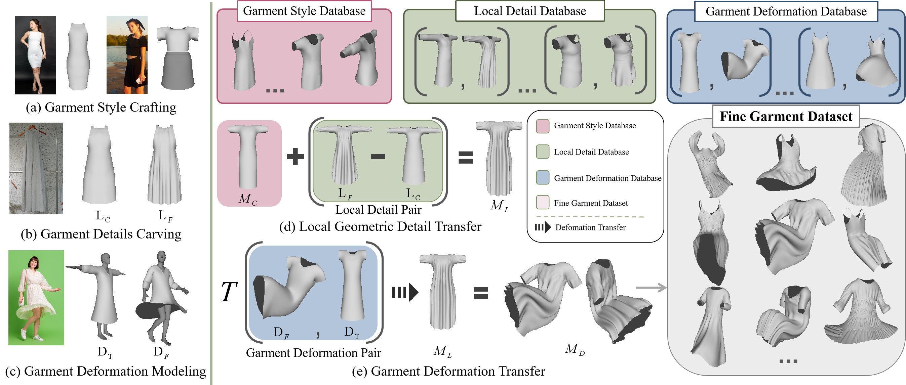

## GarVerseLOD Dataset
We present a new strategy for constructing a progressive garment dataset with levels of details. We first construct three basic databases with different levels of detail: Garment Style Database, Local Detail Database and Garment Deformation Database. Fine garments can be synthesized from the three basic databases.

### Fine Garment Dataset

[Here](https://drive.google.com/drive/folders/1_5N8gFdjw10JPrw3NwBTMIlMWcc67p4c?usp=sharing) we provide some synthesized fine garments in the category of loose-fitting clothing (i.e., dresses and skirts).

### Three Basic Databases

Coming soon.