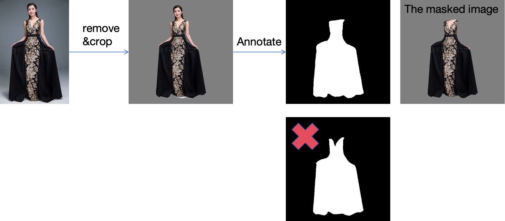

## Demo

To use our prepared inputs, please follow these instructions:

- Get normal map

  ```
  bash 0_normal_estimator/00_predict_normal.sh
  ```

- Get coarse garment (Waiting for simplification: we currently use the ICON code to predict smpl, which actually includes some unnecessary operations)

  ```
  bash 1_coarse/00_get_smpl.sh
  bash 1_coarse/01_get_tpose_garment_on_mean_body.sh
  bash 1_coarse/02_pose_garment.sh
  ```

- Get fine garment

  ```
  bash 2_fine/00_format_data.sh
  bash 2_fine/01_predict_wild.sh
  # todo: bash 2_fine/02_refine_boundary.sh
  ```

  Here we are using 2D-aware boundary predictions, and the code for 3D-aware boundary is in preparation. We have increased the training data, and now the 2D-aware results are actually close to the 3D-aware boundary predictions.

- Registration

  ```
  # boundary fitting
  bash 3_fitting/00_format_target.sh
  bash 3_fitting/01_format_src.sh
  bash 3_fitting/10_boundary_fitting.sh
  bash 3_fitting/11_get_landmark_indices_all.sh
  # nicp
  bash 3_fitting/20_opt_occ_all.sh
  bash 3_fitting/21_refine.sh
  ```

Then you can find all the results in `outputs/results/`. The current version only provides code for dresses. If the result of nicp is not satisfactory, try adjusting the loss weights.: `3_fitting/nicp/config/cloth.json`

## Prepare Your Data

To prepare your own data, you need to:

- Remove the background and crop the image: [rembg](https://github.com/danielgatis/rembg), [ICON](https://github.com/YuliangXiu/ICON)
- Annotate the garment mask. **Please note that the mask should cover the entire garment, including the invisible region (e.g., the area obstructed by the body, as shown in the following image)**

